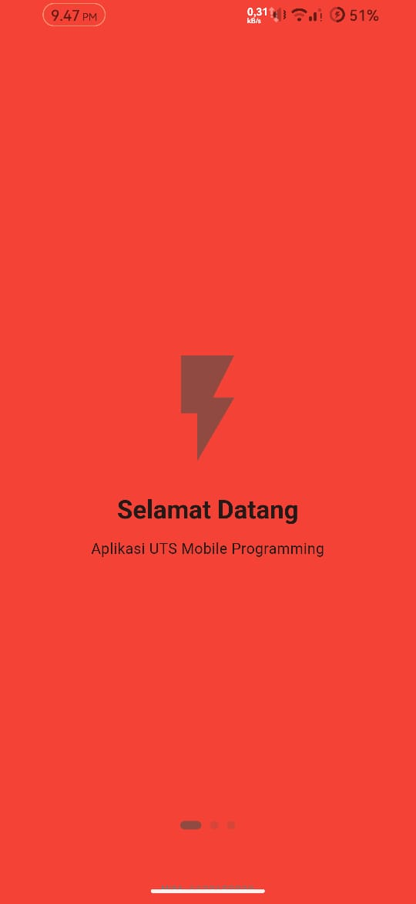
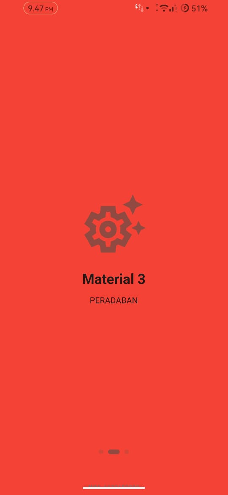
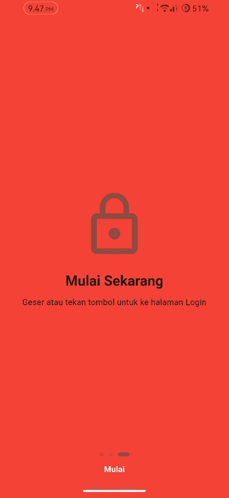
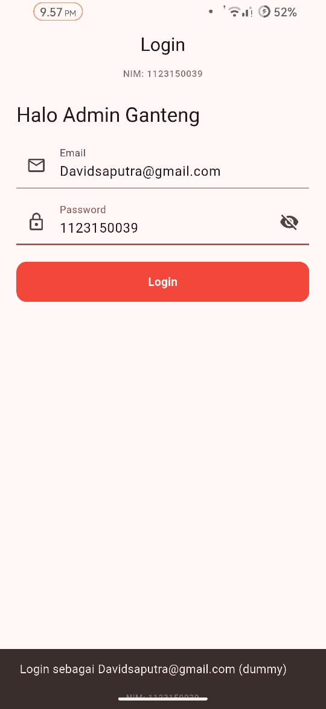

<!-- Banner animasi -->
<p align="center">
  
</p>

<h1 align="center"> KB1179 UTS - Flutter Mobile Programming</h1>
<h3 align="center">David Saputra • NIM: 1123150039</h3>

<p align="center">
  
  
  
</p>

---

## 🎨 Deskripsi
Proyek **UTS Pemrograman Mobile KB1179** ini merupakan aplikasi Flutter sederhana yang menampilkan:

- 🌈 **Material 3 Theme** dengan seed color `Colors.red`
- 🚀 **Splash Screen geser (3 halaman)** menggunakan `PageView`
- 🔐 **Halaman Login** dengan validasi & SnackBar
- 🧾 **Footer NIM global** untuk verifikasi penguji

---

## 📱 Tampilan Aplikasi
| Splash 1 | Splash 2 | Splash 3 | Login |
|-----------|-----------|-----------|--------|
|  |  |  |  |

<p align="center">
  <br>
  <em>Swipe kanan-kiri buat pindah antar splash 👆</em>
</p>

## 🛠️ Cara Menjalankan
```bash
flutter pub get
flutter run
atau
flutter run -d chrome
